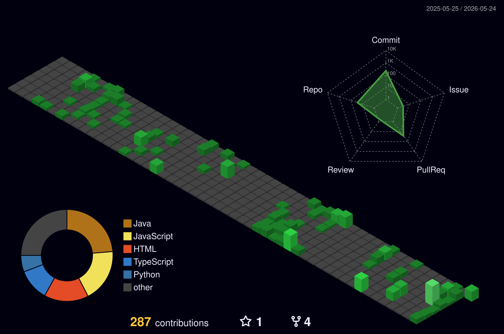

<h1 align="center">
  
</h1>

  

---

## About Me

- Problem Solver
- Competitive Programming Enthusiast
- Data Structures & Algorithms
- Java Backend Developer
- React Frontend Developer

---

## Programming Languages

---

## Frontend Development

---

## Backend Development

---

## Databases

---

## Machine Learning

---

## Tools & Technologies

---

## GitHub Analytics

  
  

  

---

## Contribution Calendar

  

---

## GitHub Activity Graph

  

---

## Productivity Stats

  

  

---
